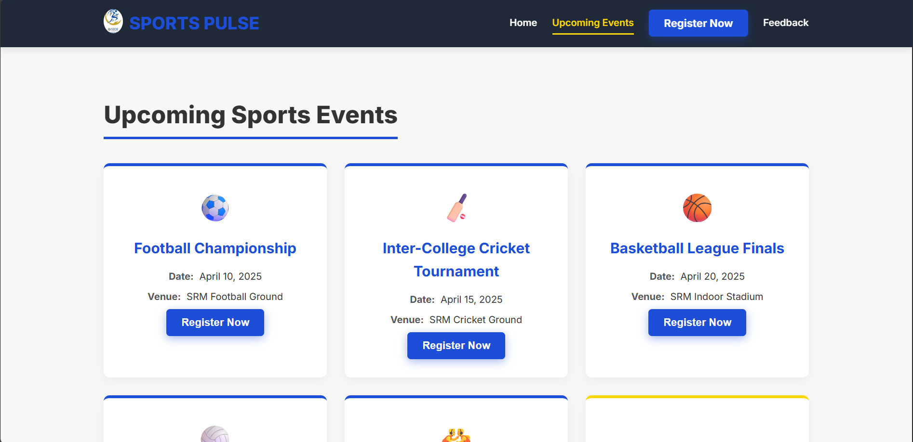
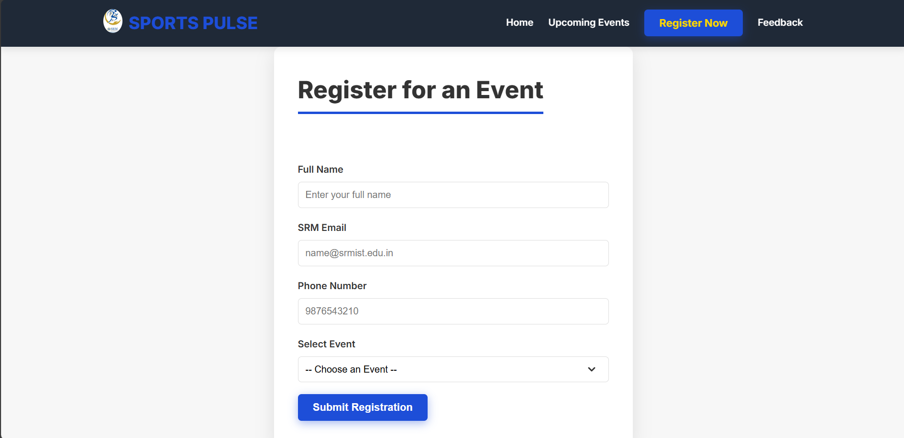
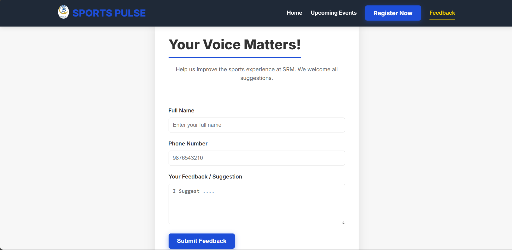

# 🏀 Sports Pulse - SRM College Sports Portal

**Sports Pulse** is a responsive and elegant web platform to display and manage **sports events** at **SRM College**. It covers everything from past match reports to upcoming event registrations.

---

## 🎯 Project Objectives

- Showcase past sports events with images and descriptions.
- Display upcoming sports events with registration links.
- Provide a clean, student-focused user experience.

---

## 🛠️ Tech Stack

- **Frontend**: HTML, CSS, JavaScript
- **Backend**: PHP
- **Database**: MySQL (via XAMPP/phpMyAdmin)

---

## 🗄️ Database Structure

**Database Name**: `sports_pulse_db`

### 1. `events` Table

| Column       | Type           | Description                       |
|--------------|----------------|-----------------------------------|
| id           | int(11)        | Auto Increment (PK)               |
| name         | varchar(100)   | Event Name                        |
| date         | date           | Date of the Event                 |
| venue        | varchar(100)   | Event Venue                       |
| type         | varchar(50)    | Event Type (Football/Basketball...) |
| description  | text           | Detailed info about the event     |
| image_path   | varchar(255)   | Optional: path to event image     |

---

### 2. `registrations` Table

| Column     | Type           | Description                  |
|------------|----------------|------------------------------|
| id         | int(11)        | Auto Increment (PK)          |
| name       | varchar(100)   | Student Name                 |
| email      | varchar(100)   | Email                        |
| event_id   | int(11)        | Linked to `events.id`        |
| phone      | varchar(10)    | Contact number               |

---

## 🧩 Features

✅ Home Page with Latest News & Past Events  
✅ Upcoming Events Section (with date & venue displayed neatly)  
✅ Event Registration Page  
✅ Fully Responsive UI (Black & White Theme)  
✅ Mobile App (under development - displays only SRM sports news/events)  
✅ Backend in PHP with MySQL

---

## 🖼️ Screenshots

### 🏠 Home Page

### 📅 Upcoming-Events Page

### 🏠 Register Page

### 📈 Feedback Page

---

## 🚀 How to Run

1. Install **XAMPP**.
2. Place the `sports_pulse` folder inside the `htdocs` directory.
3. Start **Apache** and **MySQL** via XAMPP.
4. Open **phpMyAdmin** and:
   - Create a database: `sports_pulse_db`
   - Import or manually create the `events` and `registrations` tables.
5. Open your browser and go to:  
   `http://localhost/sports_pulse`

---

